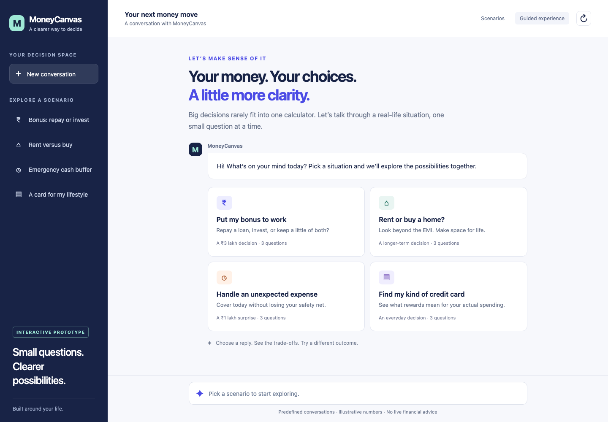

# MoneyCanvas

A working web prototype for exploring personal money decisions through a guided chatbot. Choose a scenario, click through three questions, then explore a financial comparison inside the conversation.

**No LLM, API key, account, or backend connection is needed.** Conversations are authored in advance; financial results are calculated locally. There are no analytics, external fonts, or data uploads. Refreshing resets the session.



## Run locally

On this Mac, double-click **Open MoneyCanvas.command**. It opens the app in your browser. Keep its terminal window open while using the prototype.

Or, with Node.js 20 or newer:

```sh
npm start
```

Open **http://127.0.0.1:4173**. The application itself has no npm dependencies, so installation is not required to run it. Stop the server with Ctrl+C. Use `PORT=4174 npm start` if the default port is occupied.

## Four conversations

| Scenario | Choices | Interactive output |
| --- | --- | --- |
| Bonus allocation | Debt vs growth, existing safety buffer, 3 or 5 years | Compare repayment, investing, splitting, and cash; change assumed investment return |
| Rent vs buy | Expected stay, flexibility vs stability, monthly comfort budget | Compare projected net wealth and ownership affordability; change home appreciation |
| Emergency expense | Essential expenses, client payment delay, cash vs debt preference | Compare savings, FD withdrawal, and EMI; stress-test delayed income |
| Credit card fit | Spending profile, reward redemption, annual fee preference | Compare three fictional cards after fees; adjust travel spending |

Each conversation includes predefined follow-up questions, an editable what-if slider, model assumptions, a previous-answer control, restart, and scenario switching. The layout adapts to smaller screens and supports keyboard navigation. There are 54 complete combinations of predefined answers.

## A suggested demonstration

1. Open **Put my bonus to work**.
2. Choose **A balance of both**, **About ₹2.4L · 6 months**, then **I can leave it for 5 years**.
3. Move investment return between 0% and 12% to show how the result changes.
4. Click **Give me the short version** for a contextual summary.
5. Use **Change my answers** and choose a two-month emergency buffer to show how liquidity changes the conversation.
6. Try **Rent or buy a home?** with a three-year stay and an ₹80,000 budget to show the affordability constraint.

## What is real and what is simulated

- Real: clickable conversations, branching content, numerical models, sliders, comparison charts, navigation, and responsive layout.
- Simulated: the conversational intelligence, personas, rates, products, financial situations, and all validation evidence.
- No real bank accounts, card products, user interviews, or live market data are connected.
- These are illustrative comparisons, not investment recommendations. Assumptions and limitations appear inside each result. This prototype is not evidence of completed user testing.

The loan model amortizes debt monthly, holds the EMI budget equal across options, and invests freed payments. The home model includes purchase and sale costs, remaining loan debt, rent increases, maintenance, and investment of cash-flow differences. The emergency model distinguishes bank cash from remaining fixed deposits. The card model uses fictional reward rules, redemption values, and annual fees including an assumed tax.

## Edit or extend

- `dist/scenarios.js`: scenario descriptions, three-question flows, clickable replies, and authored responses.
- `dist/finance.js`: deterministic calculations and formatting.
- `dist/app.js`: chat state, results, follow-ups, and optional browser-agent actions.
- `dist/styles.css`: visual design and responsive layout.
- `dist/index.html`: application shell and metadata.
- `scripts/serve.mjs`: small local static server.

All public assets are in `dist/`. It can be served by any static web host over HTTP; opening the HTML directly via `file://` does not load browser modules reliably. A live website has not been published as part of the repository delivery.

## Checks

```sh
npm test
npm run check
```

Tests cover loan amortization, equal-budget bonus comparisons, home transaction costs, emergency shortfalls, and card reward rules. See `docs/QA.md` for browser validation. To rerun browser checks while the local server is running:

```sh
npm ci
npx playwright install chromium
npm run test:ui
```

Optional WebMCP actions register only in browsers that provide `document.modelContext`; they start a scenario or select a reply using the same visible app state. They do not call an LLM or a network service.
